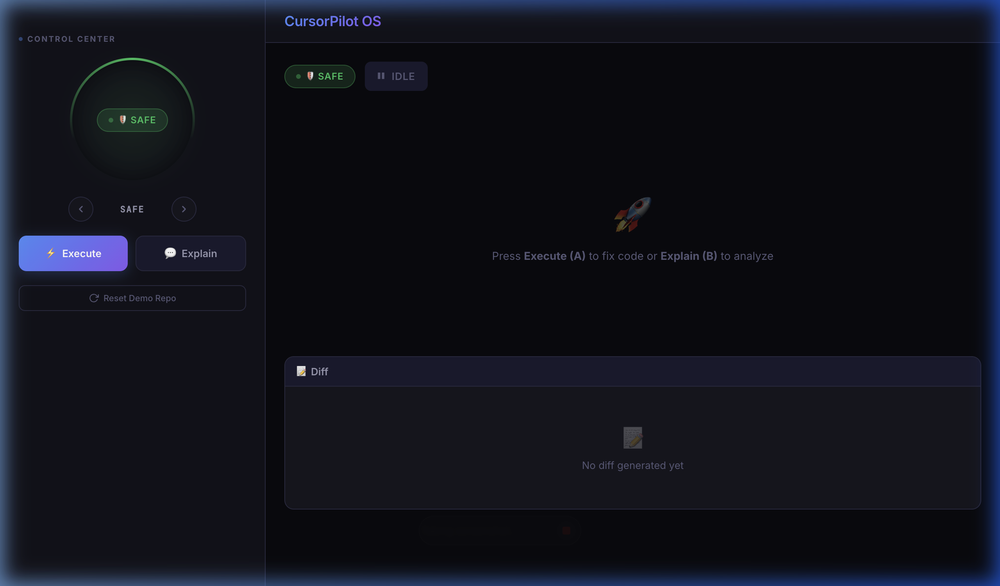
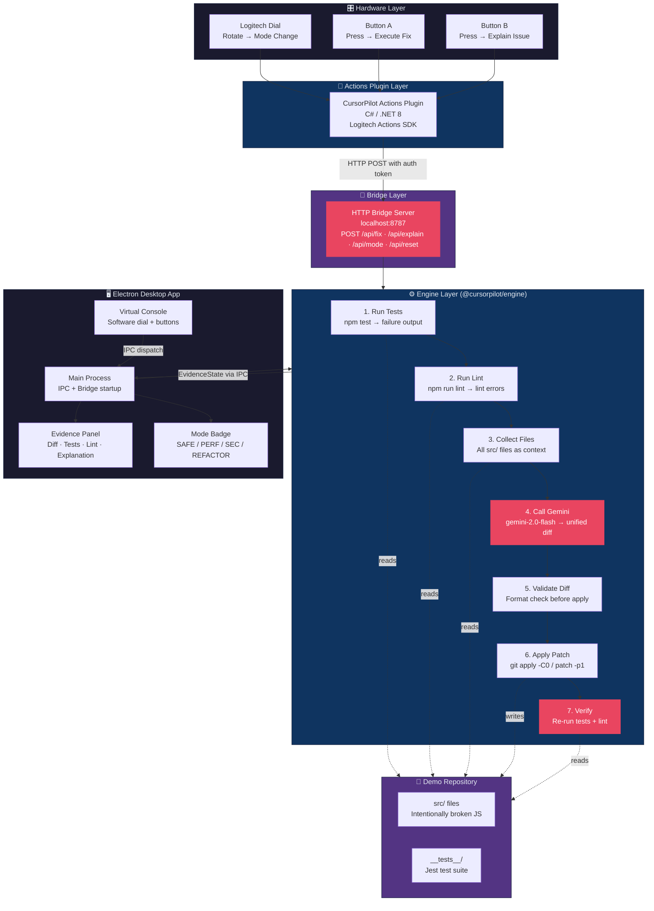
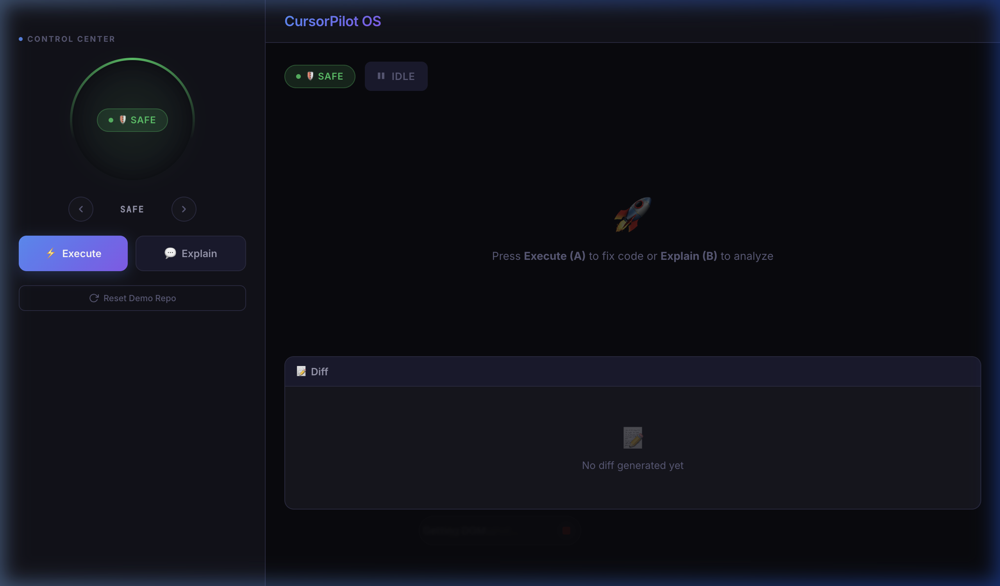

# 🖱️ CursorPilot OS

**Hardware-Driven AI Code Repair — Powered by Google Gemini**

> AI that fixes your broken code at the turn of a dial. Every patch is **test-gated and evidence-backed**. No fix applied without a passing re-run. Controlled from your desk via a physical Logitech dial — or a simulated Virtual Console.

[](https://www.electronjs.org) [](https://ai.google.dev) [](https://react.dev) [](https://www.typescriptlang.org) [](./LICENSE)

**Key Technologies:** Electron · React · Gemini API · Unified Diff Patching · Logitech Actions SDK · Bridge HTTP Server · Virtual Console

<p align="center">
  
</p>

---

## 📋 Table of Contents

1. [Problem Statement](#-problem-statement)
2. [Solution Overview](#-solution-overview)
3. [Architecture](#-architecture)
4. [Core Features Deep Dive](#-core-features-deep-dive)
5. [Workflow Pipeline](#-workflow-pipeline)
6. [Operating Modes](#-operating-modes)
7. [Local Setup](#-local-setup)
8. [Demo Walkthrough](#-demo-walkthrough)
9. [Project Structure](#-project-structure)
10. [License](#-license)

---

## ❌ Problem Statement

AI code assistants sound transformative — until they silently break more than they fix:

| Failure Mode | What Happens | Real-World Impact |
|---|---|---|
| **Hallucinated Patches** | LLM generates diffs that don't apply cleanly | Build breaks, debugging takes hours |
| **No Validation Loop** | Fix applied without re-running tests | Regressions ship to production |
| **Context-Blind Suggestions** | LLM sees only a snippet, not the whole repo | Partial fixes that miss root causes |
| **No Auditability** | You can't see what changed or why | Code review becomes guesswork |

Current AI tools generate confident-sounding suggestions with no accountability. **CursorPilot OS takes the opposite approach.**

---

## ✅ Solution Overview

CursorPilot OS is a **hardware-driven AI repair loop** where every code fix is grounded in real test and lint failure output:

- 🔴 **Test-gated pipeline** — runs `npm test` and `npm run lint` first; Gemini only sees real failures
- 🧠 **Whole-repo context** — all `src/` files are collected and sent as context, no snippet guessing
- 🔧 **Unified diff patching** — Gemini outputs a standard `git diff` format, applied with `git apply`
- ✅ **Re-run verification** — tests and lint are re-run after the patch; failures are surfaced immediately
- 🎛️ **Hardware controls** — physical Logitech dial rotates the repair mode; buttons trigger fix or explain
- 🖥️ **Virtual Console** — software fallback for the same controls when no hardware is connected
- 📋 **Full evidence panel** — diff viewer, test output, lint results, and Gemini explanation side-by-side

**Every fix is validated. Every change is visible. No silent edits.**

---

## 🏗 Architecture



---

## 🔍 Core Features Deep Dive

### 1. Gemini-Powered Diff Generation

Gemini receives the full test + lint failure output alongside all `src/` files and is instructed to output a single valid unified diff:

```typescript
// packages/engine/src/llm/client.ts
const result = await model.generateContent([
  { text: systemPrompt },
  { text: buildUserPrompt({ testOutput, lintOutput, sourceFiles, mode }) },
]);
// Returns a standard `--- a/... +++ b/...` unified diff
```

The model is `gemini-2.0-flash` by default — fast enough for interactive use while maintaining code quality.

### 2. Unified Diff Validation

Before any patch is applied, the diff is validated for correct format:

```typescript
// packages/engine/src/llm/diffValidator.ts
function validateDiff(diff: string): ValidationResult {
  const hasHeader = /^---\s+a\//m.test(diff) && /^\+\+\+\s+b\//m.test(diff);
  const hasHunk = /^@@\s+-\d+/m.test(diff);
  return { valid: hasHeader && hasHunk, errors };
}
```

Invalid diffs are rejected before touching the repo — no corrupted files, no half-applied changes.

### 3. Git-Based Patch Application

Patches are applied via `git apply` with a fallback to the system `patch` command:

```bash
# Primary (packages/engine/src/patch/applyPatch.ts)
git apply -C0 --whitespace=fix patch.diff

# Fallback
patch -p1 < patch.diff
```

Using git keeps the patch auditable — you can see exactly what changed with `git diff`.

### 4. Bridge HTTP Server

The bridge enables the C# Logitech plugin to control the engine over HTTP:

```
POST /api/fix     — Trigger 7-step repair pipeline (requires X-CursorPilot-Token)
POST /api/explain — Ask Gemini to explain the current failures (auth required)
POST /api/mode    — Set SAFE / PERF / SEC / REFACTOR mode (auth required)
POST /api/reset   — Revert demo repo to broken state (auth required)
GET  /api/evidence — Read current EvidenceState (no auth)
```

📁 [`packages/engine/src/bridge/httpServer.ts`](./packages/engine/src/bridge/httpServer.ts)

### 5. Evidence State

Every action produces a typed `EvidenceState` that drives the UI in real-time:

```typescript
// packages/shared/src/types.ts
interface EvidenceState {
  mode: 'SAFE' | 'PERF' | 'SEC' | 'REFACTOR';
  status: 'IDLE' | 'RUNNING' | 'PASS' | 'FAIL' | 'ERROR';
  diff: string | null;            // The unified diff Gemini generated
  patchResult: PatchResult | null;
  testResult: RunResult | null;
  lintResult: RunResult | null;
  explanation: string | null;     // Markdown from Button B (explain)
  updatedAt: number;
}
```

📁 [`packages/shared/src/types.ts`](./packages/shared/src/types.ts)

### 6. Virtual Console

The Virtual Console renders a software replica of the Logitech hardware for demos without physical devices:

```typescript
// apps/desktop/src/renderer/components/VirtualConsole.tsx
// Rotate left/right → dispatch({ type: 'ROTATE', direction })
// Press A → dispatch({ type: 'PRESS_A' })  → triggers fix pipeline
// Press B → dispatch({ type: 'PRESS_B' })  → triggers explain
```

📁 [`apps/desktop/src/renderer/components/VirtualConsole.tsx`](./apps/desktop/src/renderer/components/VirtualConsole.tsx)

---

## 🔄 Workflow Pipeline

Every fix execution runs a deterministic 7-step pipeline:

```
Run Tests → Run Lint → Collect Files → Call Gemini → Validate Diff → Apply Patch → Verify
```

| Step | What It Does | Implementation |
|---|---|---|
| **1. Run Tests** | Execute `npm test` in demo-repo; capture stdout/stderr | `packages/engine/src/run/testRunner.ts` |
| **2. Run Lint** | Execute `npm run lint`; capture all lint errors | `packages/engine/src/run/lintRunner.ts` |
| **3. Collect Files** | Read all `src/` files for full LLM context; **Early exit if tests and lint both pass** | `packages/engine/src/git/fileCollector.ts` |
| **4. Call Gemini** | Send failures + source to Gemini; receive unified diff | `packages/engine/src/llm/client.ts` |
| **5. Validate Diff** | Check diff headers, hunks, and file paths before apply | `packages/engine/src/llm/diffValidator.ts` |
| **6. Apply Patch** | `git apply -C0`; fallback to `patch -p1` | `packages/engine/src/patch/applyPatch.ts` |
| **7. Verify** | Re-run tests + lint; set status PASS / FAIL / ERROR | `packages/engine/src/actions/actionRouter.ts` |

Each step updates the `EvidenceState` — the UI reflects every transition in real-time.

---

## 🎛️ Operating Modes

Rotate the dial (or click arrows in the Virtual Console) to switch the repair policy sent to Gemini:

| Mode | Focus | Gemini Instruction |
|---|---|---|
| **SAFE** | Minimal, conservative changes | Fix only what the tests catch; no refactoring |
| **PERF** | Performance optimization | Improve efficiency; eliminate redundant operations |
| **SEC** | Security hardening | Fix vulnerabilities; apply secure coding practices |
| **REFACTOR** | Code quality | Clean up structure; improve readability and patterns |

Mode is included in the Gemini system prompt, shaping the style and scope of every generated patch.

📁 [`packages/engine/src/actions/modes.ts`](./packages/engine/src/actions/modes.ts)

---

## 🛠️ Local Setup

### Prerequisites

- Node.js ≥18
- Google Gemini API key ([get one here](https://aistudio.google.com/app/apikey))
- *(Optional)* Logitech Options+ with Actions SDK for hardware control

### Quick Start

```bash
# Clone and install
git clone https://github.com/manojmallick/cursorpilot-os.git
cd cursorpilot-os
npm install

# Configure environment
cp .env.example .env
# Edit .env and add your GEMINI_API_KEY

# Build all packages
npm run build

# Launch the desktop app
npm run dev
```

### Environment Configuration

```env
# .env
GEMINI_API_KEY=your_gemini_api_key_here
GEMINI_MODEL=gemini-2.0-flash        # Optional: override the model
BRIDGE_PORT=8787                     # Optional: override the bridge port
BRIDGE_TOKEN=your_secret_token_here  # Token for authenticated bridge endpoints
```

### Running Without Hardware

The app launches with the Virtual Console by default — no Logitech hardware required. Use the on-screen dial and buttons to trigger the full pipeline.

### Logitech Hardware Setup *(Optional)*

1. Install Logitech Options+
2. Build and register the C# plugin:
   ```bash
   cd plugins/cursorpilot-actions-plugin
   dotnet build
   ```
3. Import the plugin into Logi Options+ Actions
4. Map your dial and buttons to the CursorPilot actions

---

## 🎬 Demo Walkthrough

### 1. Start Fresh — Broken Repo *(10s)*
- The `demo-repo/` starts with 3 intentionally broken JS files
- Navigate to the Evidence Panel → **Run Tests** to see failures
- All 3 tests fail; lint reports multiple violations

### 2. Execute Fix *(30s)*
- Press **Button A** (or click in Virtual Console)
- Watch the pipeline run: Tests → Lint → Collect → Gemini → Validate → Patch → Verify
- The diff appears in the Diff Viewer; test results update to PASS

| Control Center | Evidence Panel |
|---|---|
|  |  |

### 3. Switch Modes *(15s)*
- Rotate the dial to **PERF** mode
- Click **Reset** to revert the demo repo
- Press **Button A** again — Gemini now optimizes for performance rather than minimal change

| Full App — SAFE Mode | Full App — IDLE State |
|---|---|
|  |  |

### 4. Explain Mode *(20s)*
- Press **Button B** to trigger the explain pipeline
- Gemini analyzes the failures and returns a structured Markdown explanation
- The Evidence Panel renders the explanation alongside the raw test output

---

## 📁 Project Structure

```
cursorpilot-os/
├── apps/
│   └── desktop/                    # Electron desktop application
│       └── src/
│           ├── main/
│           │   ├── main.ts         # App entry: BrowserWindow + IPC + bridge startup
│           │   └── preload.ts      # Exposes window.api to renderer
│           └── renderer/
│               ├── App.tsx         # Root component + state management
│               ├── components/
│               │   ├── VirtualConsole.tsx  # Software dial + button simulation
│               │   ├── DiffViewer.tsx      # Renders generated unified diffs
│               │   ├── MarkdownRenderer.tsx # Renders Gemini explanations
│               │   ├── TestPanel.tsx       # Test + lint output display
│               │   └── ModeBadge.tsx       # Current mode indicator
│               └── pages/
│                   ├── Console.tsx         # Left sidebar (Virtual Console)
│                   └── Evidence.tsx        # Right panel (Diff + Results)
│
├── packages/
│   ├── engine/                     # Core AI fix engine
│   │   └── src/
│   │       ├── actions/
│   │       │   ├── actionRouter.ts # Main dispatch + 7-step pipeline orchestration
│   │       │   ├── modes.ts        # Mode cycling (SAFE→PERF→SEC→REFACTOR)
│   │       │   └── policy.ts       # Mode-to-prompt policy definitions
│   │       ├── bridge/
│   │       │   └── httpServer.ts   # HTTP server :8787 for Logitech plugin
│   │       ├── git/
│   │       │   ├── repoManager.ts  # Git status, diff, file reading (simple-git)
│   │       │   └── fileCollector.ts # Collects src/ files for LLM context
│   │       ├── llm/
│   │       │   ├── client.ts       # Gemini API: generateDiff, explainIssue
│   │       │   ├── prompts.ts      # System + user prompt builders
│   │       │   └── diffValidator.ts # Validates diff format before apply
│   │       ├── patch/
│   │       │   ├── applyPatch.ts   # git apply -C0; fallback to patch -p1
│   │       │   └── unifiedDiff.ts  # Unified diff parse/format helpers
│   │       └── run/
│   │           ├── testRunner.ts   # Runs npm test in demo-repo
│   │           └── lintRunner.ts   # Runs npm run lint in demo-repo
│   │
│   ├── sdk-sim/                    # Simulated hardware SDK
│   │   └── src/
│   │       └── simulatedConsole.ts # Emits hardware events from software input
│   │
│   └── shared/                     # Shared types + utilities
│       └── src/
│           ├── types.ts            # Mode, ActionEvent, EvidenceState, IPC channels
│           └── utils.ts            # truncate(), sleep()
│
├── plugins/
│   └── cursorpilot-actions-plugin/ # C#/.NET 8 Logitech Actions SDK plugin
│       └── CursorPilotPlugin/
│           ├── Plugin.cs           # Plugin entry point
│           ├── manifest.json       # Action definitions (fix, explain, mode, reset)
│           ├── Actions/            # Per-action C# handlers
│           └── Bridge/             # HTTP client calling :8787
│
├── demo-repo/                      # Target repo (intentionally broken)
│   ├── src/
│   │   ├── fileStore.js            # Broken: lint violations
│   │   ├── formatName.js           # Broken: wrong string template syntax
│   │   └── sum.js                  # Broken: uses wrong operator
│   └── __tests__/                  # Jest tests that fail against broken src
│
├── sample/                         # Reference materials
├── .env.example                    # Environment variable template
├── package.json                    # Monorepo root (npm workspaces)
└── tsconfig.base.json
```

---

## 📄 License

MIT License — see [LICENSE](./LICENSE)

---

## 🙏 Acknowledgments

Built to demonstrate hardware-software-AI integration for developer tooling. The repair loop — test → lint → context → Gemini → diff → patch → verify — runs entirely on the local machine. No cloud build servers. No magic. Just a dial, a button, and a model that knows how to read a stack trace.

---

**Quick Links:**
[⚙️ Engine](./packages/engine/) · [🖥️ Desktop App](./apps/desktop/) · [🔌 Logitech Plugin](./plugins/cursorpilot-actions-plugin/) · [📁 Demo Repo](./demo-repo/)
